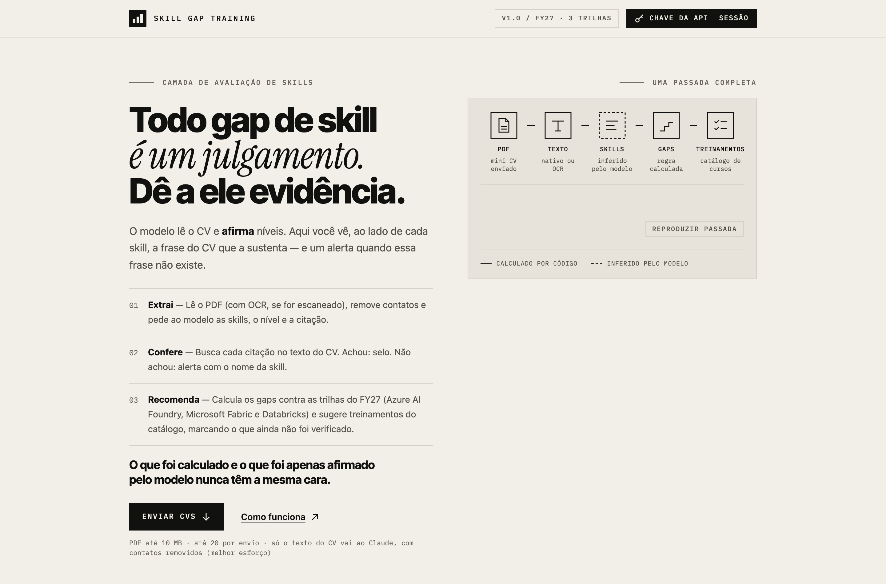

# Skill Gap Training

**Todo gap de skill é um julgamento. Dê a ele evidência.**

Você sobe o mini CV de uma pessoa, e o sistema devolve as skills dela por trilha do FY27, os gaps, um
rating e uma lista de treinamentos em ordem de nível, cada skill com a frase do CV que a sustenta.



<sub>Tela inicial da interface (build de produção, tema claro). Linha cheia no diagrama: calculado por
código; tracejada: inferido pelo modelo.</sub>

> **Status:** os 482 testes automáticos do backend passam, e uma execução manual com o Claude real
> funcionou de ponta a ponta durante o desenvolvimento (18 citações do modelo, 16 localizadas no CV).
> Nenhum teste automático chama a API real, e a qualidade da extração ainda não foi avaliada em escala.
> Trate a v1 como pronta para validar com CVs reais, não como validada. Detalhes em
> [O que está e o que não está verificado](#o-que-está-e-o-que-não-está-verificado).

## Por que isto existe

Você tem mini CVs em PDF e uma base de treinamentos para o FY27 com três trilhas: **Azure AI Foundry**,
**Microsoft Fabric** e **Databricks**, todas com uso de AI. Para recomendar um curso a alguém, alguém
precisa ler o CV, decidir até onde a pessoa domina cada skill, comparar com o que a trilha espera e escolher
treinamentos do catálogo. É um trabalho repetitivo, e cada nível atribuído no fim é uma opinião.

Entregar a leitura a um modelo tira a repetição e cria outro problema: o modelo afirma um nível com a
mesma confiança quando acerta e quando erra, e quem assina a recomendação precisa saber o que dá para
conferir. Este projeto faz as duas coisas, extrair e recomendar, e mostra ao lado de cada skill a citação do CV
que a sustenta. O que é calculado por código e o que é apenas afirmado pelo modelo nunca têm a mesma cara.

## O que ele faz

1. Você abre a interface (`http://localhost:3000`) e, para usar o Claude de verdade, cola a chave no popup
   **Chave da API**. Ela fica só na memória da API local.
2. Arrasta até 20 mini CVs em PDF (10 MB cada). PDFs escaneados passam por OCR.
3. Acompanha cada CV no diagrama "Uma passada completa": PDF, texto, skills, gaps, treinamentos.
4. Abre o cartão do candidato e vê as skills por trilha, cada uma com nível e citação. Um selo diz se a
   citação existe no texto do CV, e uma faixa nomeia as que não existem.
5. Lê o ledger: quantas citações o modelo deu, quantas foram localizadas, os gaps por severidade e o
   **Rating FY27** (aderência e nível por trilha, com a nota de que é uma regra sobre níveis inferidos).
6. Recebe os treinamentos do catálogo agrupados em Básico, Intermediário e Avançado, escolhe a data de
   início e a cadência, e obtém um cronograma sugerido.
7. Exporta o resultado em CSV ou XLSX. Para uma pasta inteira, sem interface, existe a CLI
   (`python -m skillgap.cli process ./cvs --out ./out`).

## Como funciona

Cada etapa é código, exceto uma:

```
PDF ──▶ texto ──▶ sem contatos ──▶ Claude ──▶ nomes da taxonomia ──▶ citação está no CV? ──▶ gaps + rating ──▶ treinamentos
        nativo/OCR    regex         infere      casamento por regra    busca de texto         regra             catálogo SQLite
        código        código        MODELO      código                 código                 código            código
```

```
navegador (Next.js) ──HTTP──▶ API FastAPI ──▶ pipeline ──▶ Claude (só o texto do CV, sem contatos)
                                  │               │
                                  ▼               ▼
                     SQLite: resultados + catálogo    OCR local (Tesseract)
```

**Decisões que moldaram o desenho, e por quê**

- **O modelo só infere; o resto é código.** Skills, nível e citação vêm do Claude. A busca da citação no
  CV, o casamento com a taxonomia, os gaps, o rating e o ranking de treinamentos são regras determinísticas.
  Assim quem revisa sabe exatamente onde está a opinião.
- **A citação é conferida por busca de texto**, com fronteira de palavra e de número (`"team of 5"` não casa
  com `"team of 50"`). O selo verde prova que a frase existe no CV, não que ela sustenta a skill: revise.
- **Saída estruturada com `messages.parse`.** O `claude-sonnet-5-5` responde HTTP 400 a `tool_choice`
  forçado. Descobrimos isso numa revisão, e um teste de contrato agora garante que o pedido não o usa.
- **O rating é uma regra sobre níveis inferidos.** Por isso nunca é apresentado como medição, e vem com um
  segundo número que só conta skills cuja citação foi achada (um piso).
- **Privacidade por construção.** Só o texto do CV vai ao Claude, com contatos removidos por regex (melhor
  esforço). O OCR roda na sua máquina.
- **A chave vive só na memória da API.** As rotas `/settings` exigem `Origin` de `localhost:3000` e a API
  inteira só aceita `Host` local. Motivo: um site aberto no seu navegador não pode plantar uma chave alheia
  (e depois ler seus CVs no painel do provedor), nem usar DNS rebinding para ler os resultados.
- **O catálogo mora no SQLite e é lido a cada CV.** Editar o banco vale para o próximo CV. O CSV só semeia
  uma tabela vazia e nunca sobrescreve suas edições.
- **Um processo, um arquivo SQLite.** Simples e suficiente para uma pessoa; não serve para várias.

**Stack:** Python 3.11+ · FastAPI · pdfplumber + pypdfium2 + Tesseract (OCR) · Anthropic SDK
(`claude-sonnet-5-5`, `messages.parse` com um modelo Pydantic) · SQLite · Next.js 15 (TypeScript) ·
SVG inline + [Motion](https://motion.dev) (`motion/react`), com animações que respeitam
`prefers-reduced-motion`.

## Estrutura do projeto

```
backend/   pipeline e API em Python
  src/skillgap/  pdf_reader · privacy · skill_extractor · evidence · classifier · gap_analyzer · rating ·
                 recommender · catalog_store · pipeline · store · service · keystore · settings_api ·
                 exports · api · cli · demo
  config/        taxonomy_fy27.yaml · catalog_fy27.csv   (editáveis; o CSV só semeia o catálogo SQLite)
  tests/
frontend/  interface Next.js (upload, progresso por CV, cartão do candidato, popup da chave)
docs/superpowers/  spec e plano de implementação
```

### Medido × afirmado (design Ledger)

A interface segue o design system **Ledger**: o que foi *calculado* nunca se parece com o que foi
*afirmado pelo modelo*.

| | Origem | Na interface |
|---|---|---|
| Nível de cada skill, citação, nome do candidato | **Afirmado** pelo modelo | Nunca fica verde |
| A citação existe no texto do CV (`evidence_verified`) | **Calculado** (busca de texto, sem LLM) | Selo verde `✓ citação no CV`; se não existe, selo terracota e faixa "Citação não encontrada" |
| Casamento de nomes com a taxonomia | **Calculado** | Entra no bloco "Calculado, não estimado" |
| Gaps e ranking dos treinamentos | Contas calculadas, **mas a partir dos níveis inferidos** | Não recebem selo de "medido" |
| Trilha sem dados | Fato conhecido | Faixa "Sem dados", sem lista de gaps |
| Rating FY27 (aderência, nível por trilha) | Regra calculada **sobre níveis inferidos** | Números em tinta, com a nota "não é uma medição" |

- O **ledger** no topo do cartão mostra as barras pareadas "citações do modelo" × "citações
  localizadas no CV" e os números do candidato. Registros processados antes da verificação não
  mostram selo nenhum (o campo é `null`, nunca `false`).
- O verde e o terracota são **reservados** a esses sinais; severidade dos gaps é só rótulo em tinta.
- A busca (`backend/src/skillgap/evidence.py`) normaliza caixa, espaços, hífens e aspas, exige
  fronteira de palavra/número e ignora trechos com menos de 8 caracteres; reticências (`…`/`...`)
  separam trechos que precisam aparecer em ordem.
- Suporta tema claro e escuro (`prefers-color-scheme`); as cores de texto pequeno passam de 4,5:1.

### Rating, níveis e cronograma

- **Rating FY27** (`backend/src/skillgap/rating.py`, dentro do ledger). Para as trilhas *com dados*:
  `aderência = 100 × Σ min(nível, esperado) ÷ Σ esperado` (um nível acima do esperado não conta a mais).
  Há um segundo número, **"com citação localizada"**, que faz a mesma conta contando só as skills cuja citação
  foi achada no CV; ele nunca passa do primeiro e funciona como piso. Cada trilha (e o total) recebe um rótulo
  pela média dos níveis das skills com evidência: `< 1,5` Básico, `< 2,5` Intermediário, senão Avançado.
  **É uma regra aplicada a níveis inferidos pelo modelo: não é uma medição** e não sugere decisão de contratação.
  Registros processados antes desta versão não têm rating (a interface não mostra nada).
- **Treinamentos por nível.** As recomendações são agrupadas em `Etapa 1 · Básico`, `Etapa 2 · Intermediário`,
  `Etapa 3 · Avançado` (numeradas em sequência entre os níveis presentes; sem nível, no fim). Dentro de cada
  etapa vale a ordem da API (cobertura de gaps).
- **Cronograma sugerido.** Você escolhe a data de início e a cadência (1 treinamento a cada 1, 2 ou 4
  semanas) e o navegador calcula as datas. **Elas vêm da cadência, não da carga horária**, que o catálogo não
  informa; é um plano sugerido, não um prazo. Nada disso é gravado no navegador.
- **Workflow animado ("Uma passada completa").** Durante um processamento real, o diagrama segue o estágio
  verdadeiro do CV (PDF → Texto → Skills → Gaps → Treinamentos) e um verbo gira com a etiqueta de
  proveniência: `CALCULADO POR CÓDIGO` ou `INFERIDO PELO MODELO`. Parado, ele toca **uma** passada
  *ilustrativa* (rotulada assim) e para; "Reproduzir passada" repete. Com movimento reduzido nada anima.
- **Ícone e favicon.** A marca (três barras ascendentes, geometria única em `frontend/lib/brand.ts`) sobe ao
  carregar e ganha uma onda enquanto há CV em processamento; o ícone da aba alterna quatro quadros durante o
  processamento real e volta ao original quando termina. `app/icon.svg` (claro/escuro), `favicon.ico` e
  `apple-icon.png` saem da mesma geometria (`frontend/scripts/make-favicon.py`, verificado por `check:brand`).
  Com movimento reduzido tudo fica estático.
- **Rodapé** com os links do projeto e as notas de privacidade, de chave e de catálogo não verificado.
- **Nível, limites e cache** (referência): níveis 0 não tem · 1 básico · 2 intermediário · 3 avançado; gap =
  `esperado − atual` com severidade alta/média/baixa; o mesmo PDF (SHA-256) não é processado duas vezes;
  10 MB por PDF e até 20 arquivos por envio.

## Requisitos

- Python 3.11+, Node 20+
- Tesseract com o idioma português (necessário para páginas escaneadas; PDFs em que todas as páginas têm texto nativo não precisam dele): `brew install tesseract tesseract-lang`. Sem o Tesseract, um PDF majoritariamente nativo ainda funciona e um PDF totalmente escaneado falha com `OCR_UNAVAILABLE`.
- Uma `ANTHROPIC_API_KEY` (só para a extração real; o modo demo e os testes não precisam)

## Rodando

**Importante:** todos os comandos do backend (`uvicorn`, `python -m skillgap.cli`,
`python -m skillgap.demo`, `pytest`) devem ser executados a partir de `backend/`, porque os caminhos
de configuração são relativos (`config/...`, `data/...`).

```bash
# Backend
cd backend
python3 -m venv .venv && source .venv/bin/activate
pip install -e ".[dev]"
export ANTHROPIC_API_KEY=...
uvicorn skillgap.api:create_app --factory --port 8000

# Frontend (outro terminal)
cd frontend && cp .env.example .env.local && npm install && npm run dev
# http://localhost:3000
```

- **Chave da API pelo popup (sem terminal):** suba a API real (`uvicorn ... --factory`, **não** o
  `python -m skillgap.demo`) e clique em **Chave da API** no topo da interface. O popup tem os botões
  `Testar` (chamada barata que não gera texto), `Salvar`, `Remover` e `Fechar`. A chave é enviada só no corpo
  de um `PUT /settings/api-key` para `localhost`, fica **apenas na memória do processo da API** (some quando
  ela reinicia) e nunca é gravada em arquivo, log, banco, `localStorage` ou cookie; nenhuma rota devolve a
  chave, só `{configured, source}`. As rotas `/settings/*` exigem `Origin` de `localhost:3000`/`127.0.0.1:3000`
  e toda a API só aceita `Host` local (contra DNS rebinding). `Remover` apaga só a chave da sessão: uma
  `ANTHROPIC_API_KEY` no ambiente continua valendo. **O `python -m skillgap.demo` usa um extrator simulado e
  não usa a chave**, mesmo que você a salve no popup.
- **Guardando a chave com segurança (macOS):** em vez de exportar a chave a cada sessão, guarde-a no
  Keychain uma única vez e suba a API com o script, que a lê de lá e nunca a imprime:

  ```bash
  security add-generic-password -a "$USER" -s skillgap-anthropic-key -w   # pede a chave, sem eco
  backend/scripts/run-api.sh                                               # sobe a API na porta 8000
  ```

  O script só escuta em `127.0.0.1`. Nunca coloque a chave em arquivo versionado, em `.env.example`
  ou em mensagens de chat; se ela vazar, revogue-a no console da Anthropic e crie outra.
- Não existe `app` no nível do módulo: use sempre `--factory`.
- Use **um único worker** do uvicorn (nada de `--workers` maior que 1): a aplicação assume que um
  só processo é dono do arquivo SQLite (ao iniciar, ela marca como falhos os registros que ficaram
  em `processing`).
- O frontend lê a API de `NEXT_PUBLIC_API_URL` (padrão `http://localhost:8000`). A API só aceita
  CORS de `http://localhost:3000` e `http://127.0.0.1:3000`.

Sem API key, para ver a interface: `python -m skillgap.demo` (a partir de `backend/`). Ele sobe a API
em `127.0.0.1:8000` com um extrator **simulado**, que devolve sempre o mesmo perfil fictício
independentemente do PDF enviado. As citações das três primeiras skills vêm de trechos reais do texto
do PDF (é preciso um PDF com pelo menos 3 linhas de 8+ caracteres), e a última (Kubernetes) é inventada de
propósito, para você ver o selo e a faixa de "citação não encontrada".

Em lote, sem interface (a partir de `backend/`):

```bash
python -m skillgap.cli process ./cvs --out ./out
```

Processa todos os `.pdf` da pasta e grava um JSON por arquivo em `--out` (padrão `out`). O código de
saída é 1 se algum CV falhar.

## Erros por CV

Quando um CV falha, o erro aparece só nele; os demais seguem.

| Código | Significado |
|---|---|
| `INVALID_PDF` | O arquivo não é um PDF válido. |
| `NO_TEXT` | Não foi possível ler texto neste PDF, nem com OCR. |
| `OCR_UNAVAILABLE` | OCR indisponível: falta instalar o Tesseract e o idioma português. |
| `LLM_INVALID_OUTPUT` | O modelo devolveu uma resposta inválida após novas tentativas. |
| `LLM_UNAVAILABLE` | Serviço de IA indisponível ou `ANTHROPIC_API_KEY` ausente. |
| `INTERNAL` | Erro interno ao processar este CV. |

## Configuração editável

| Arquivo | O que define |
|---|---|
| `backend/config/taxonomy_fy27.yaml` | Trilhas, skills, sinônimos e nível esperado (1–3) |
| `backend/config/catalog_fy27.csv` | Semente do catálogo de treinamentos (importada só quando a tabela `courses` está vazia); depois disso o catálogo vive no SQLite (ver "Catálogo de treinamentos (SQLite)") |

Variáveis de ambiente: `SKILLGAP_DB` (padrão `data/skillgap.db`), `SKILLGAP_TAXONOMY`,
`SKILLGAP_CATALOG` e `SKILLGAP_MODEL` (padrão `claude-sonnet-5-5`).

O catálogo que acompanha o repositório (`catalog_fy27.csv`) é uma **lista fornecida pelo usuário, não
verificada** (ver a seção do catálogo). A taxonomia é uma versão inicial, que deve ser revisada.

## Catálogo de treinamentos (SQLite)

As recomendações vêm de um catálogo em SQLite, no mesmo arquivo do banco de resultados
(`data/skillgap.db`, modo WAL). O pipeline lê o catálogo **a cada CV processado**: uma edição no banco
vale para o próximo CV, sem reiniciar o servidor.

**Tabelas e view**
- `courses(id, platform, title, focus, level 1-3, provider, kind, hours, link, source, verified)`;
  `kind` é `curso` ou `certificação`.
- `course_skills(course_id, skill_id)`: skills da taxonomia cobertas por curso (apaga em cascata).
- `v_course_coverage`: uma linha por curso, com as skills em `skills` (separadas por `;`).

**Semente.** Na inicialização, se `courses` estiver vazia, o `catalog_fy27.csv` (26 linhas) é importado.
Nunca sobrescreve: com a tabela já preenchida, o CSV é ignorado e suas edições ficam. CSV inválido
(skill fora da taxonomia, `nivel` inválido, id duplicado...) impede o servidor de subir, com a mensagem
apontando arquivo, linha e motivo.

**CLI** (não precisa de chave de API; usa `SKILLGAP_DB` e `SKILLGAP_TAXONOMY`):

```bash
cd backend
python -m skillgap.cli catalog stats
python -m skillgap.cli catalog list --platform fabric --level 2
python -m skillgap.cli catalog list --q rag --kind curso --limit 5     # --json para JSON
python -m skillgap.cli catalog import meu.csv             # upsert por id (insere/atualiza)
python -m skillgap.cli catalog import meu.csv --replace   # substitui o catálogo inteiro
python -m skillgap.cli catalog export catalogo.csv        # ida e volta com o import
```

O CSV aceita as colunas obrigatórias `id,titulo,skills_cobertas,nivel` e as opcionais `plataforma,foco,
provedor,tipo,carga_horaria,link,fonte,verificado`. `nivel` é 1-3 ou Fundamentals/Intermediate/Advanced
(também em português); `skills_cobertas` separa por `;` ou `,`. O formato antigo de 6 colunas ainda carrega.

**SQL direto**

```bash
sqlite3 backend/data/skillgap.db "SELECT id, level, kind, hours, skills FROM v_course_coverage WHERE platform='databricks' ORDER BY level, id;"
sqlite3 backend/data/skillgap.db "SELECT c.id FROM courses c JOIN course_skills s ON s.course_id=c.id WHERE s.skill_id='fabric.realtime';"
sqlite3 backend/data/skillgap.db "UPDATE courses SET hours=8, link='https://...' WHERE id='fabric-lakehouse';"
```

**API (somente leitura).** `GET /catalog?platform=&level=&kind=&skill=&q=&limit=` (limite padrão 100,
máximo 200; `total` é a contagem antes do limite; `level` fora de 1-3 dá 422), `GET /catalog/stats` e
`GET /catalog/{id}` (404 se não existir).

**Como editar.** Importe um CSV com `catalog import` (upsert) ou use SQL. Ao editar por SQL, mantenha
`course_skills` com ids da taxonomia (a validação da taxonomia só roda nos imports).

**Cuidado com o cache.** O resultado de cada CV fica guardado por hash SHA-256 e não é recalculado:
CVs já processados **mantêm as recomendações antigas** depois de uma mudança no catálogo. Para ver as
novas, apague o resultado desse CV e envie o PDF de novo (uma ação de "recalcular" é trabalho futuro).

**Limites honestos dos dados**
- A lista veio de um texto colado pelo usuário em 2026-09-29, parece gerada por IA: **títulos, níveis e
  provedores não foram verificados** (`verified = 0` em todas as linhas; a origem está em `source`).
- Não há links (`link` vazio) nem durações: `hours` é `NULL`, que significa **desconhecido**, nunca uma
  estimativa. Na tela e nas exportações a hora aparece vazia; no desempate, cursos sem horas ficam por último.
- O mapeamento curso -> skills da taxonomia é uma leitura do texto livre da coluna "foco" e **precisa de
  revisão** por quem conhece os cursos.

## Privacidade

Só o **texto** do CV vai para a API do Claude, depois de remover:

- e-mails e URLs de LinkedIn/GitHub;
- telefones brasileiros e internacionais (com `+`, com `55` sem `+`, com DDD) e links `wa.me/<número>`;
- números locais sem DDD (`91234-5678`) **somente quando vêm depois de um rótulo** como `Cel:`, `Tel:`,
  `Fone:`, `WhatsApp` ou `Contato:` (o rótulo é mantido); sem rótulo eles ficam, para não apagar
  períodos como `2019-2021`;
- CEPs com hífen (`01234-567`) ou de 8 dígitos depois do rótulo `CEP` (o rótulo é mantido);
- trechos de endereço em português e inglês e códigos postais do Reino Unido.

O OCR roda localmente.

Essa remoção é baseada em expressões regulares, faz o melhor esforço e **não é uma garantia**: o nome
e outros dados pessoais no texto podem permanecer. Não envie CVs que você não tem permissão para
processar com um serviço externo de LLM.

## Testes

```bash
(cd backend && pytest -q)                 # 482 testes; também passa com `pytest -W error -q`
(cd frontend && npx tsc --noEmit && npm run check:http && npm run check:ledger && npm run check:settings \
  && npm run check:schedule && npm run check:pipeline && npm run check:brand && npm run build)
```

> Não rode `npm run build` com o `npm run dev` ativo: os dois usam a pasta `.next` e o servidor de
> desenvolvimento quebra (`Cannot find module './851.js'`). Pare o servidor, faça o build e suba de novo.

`npm run check:ledger` confere a lógica pura dos números do ledger (`frontend/lib/ledger.ts`): contagens,
horas, citações sem verificação e o percentual das barras.

`npm run check:http` roda, com `fetch` simulado, os helpers HTTP da interface (`frontend/lib/http.ts`):
confirma que a chamada de rede é de fato feita, que uma falha de rede vira mensagem em português e que
erros `detail` da API são tratados.

### Microsoft Learn: catálogo oficial e busca complementar

Além da lista manual, o catálogo pode receber cursos, trilhas, certificações e exames **reais** da
Microsoft Learn, com nível, duração e link oficiais:

```bash
cd backend
.venv/bin/python -m skillgap.cli catalog sync-learn                 # idioma padrão: en-us
.venv/bin/python -m skillgap.cli catalog sync-learn --locale pt-br --report relatorio.md
```

- **De onde vem cada dado.** Nível, duração e link são da Microsoft (Learn Catalog API). O vínculo item →
  skill da taxonomia é **regra nossa** (`backend/config/learn_mapping.yaml`: produto da trilha + palavras-chave, ou
  uma frase forte no título). Na tela isso aparece como "skills casadas por regra", nunca como "verificado".
- **Duração:** só as trilhas trazem minutos confiáveis (`duration_in_minutes`, arredondados para cima em horas). Nos
  cursos, o campo `duration_in_hours` da Microsoft vale **dias × 24** (24, 48, 96, 120), não horas de estudo, então cursos,
  certificações e exames ficam com "horas não informadas" (nunca estimadas).
- **Certificações** são casadas pelo título, porque o catálogo devolve `exams` vazio para quase todas as
  relevantes; os códigos de exame só aparecem quando a Microsoft os informa.
- **A sincronização é atômica** e só mexe em linhas `learn:*`. O que some do catálogo oficial vira
  `retired` (não é recomendado nem listado, mas a linha fica). Uma resposta sem itens mapeados é recusada em vez de
  aposentar o catálogo inteiro. As linhas manuais nunca são tocadas.
- **Relatório de mapeamento** (`--report`): itens por skill, descartados por motivo e as skills sem nenhum
  item. É a ferramenta para afinar as regras.
- **Busca complementar via MCP** (`https://learn.microsoft.com/api/mcp`, ferramenta `microsoft_docs_search`):
  para gaps que **nenhum item do catálogo cobre**, a tela mostra "Leitura complementar" com links de
  documentação. Não são cursos e não têm nível. Só o nome da skill da taxonomia sai da sua máquina, nunca texto
  do CV; só links de `learn.microsoft.com` são aceitos; qualquer falha some em silêncio (as recomendações não
  dependem dela). Desligue com `SKILLGAP_LEARN_MCP=0`.
- Variáveis: `SKILLGAP_LEARN_MAPPING` (YAML de regras), `SKILLGAP_LEARN_LOCALE` (padrão `en-us`; o catálogo
  em `pt-br` tem menos itens), `SKILLGAP_LEARN_MCP`.
- Teste ao vivo, fora da suíte e com banco temporário: `cd backend && .venv/bin/python scripts/learn_smoke.py`.

### O que está e o que não está verificado

**Verificado**
- Microsoft Learn (ao vivo, 2026-09-30): o handshake completo do MCP e uma busca real; o download e a
  normalização do catálogo (62 itens mapeados: 43 trilhas, 10 cursos, 8 certificações, 1 exame; as 21 skills da
  taxonomia com ao menos um item). Os testes automáticos usam fixtures e um transporte falso, nunca a rede.
- Backend: 482 testes automáticos, incluindo o catálogo SQLite (CRUD, filtros parametrizados, view,
  coexistência WAL com o banco de resultados, API e CLI), o fluxo completo (upload → pipeline → cartão), cache por
  hash, concorrência no envio, exportações com proteção contra injeção de fórmula e o OCR real do
  Tesseract (quando instalado).
- Formato do pedido ao Claude: um teste de contrato garante que a requisição usa saída estruturada
  (`output_format`) e **não** força `tool_choice`, que o `claude-sonnet-5-5` rejeita com HTTP 400. O
  caminho de parsing foi conferido contra o SDK real com um transporte HTTP simulado.
- Interface: `tsc`, `next build`, `check:http`, `check:ledger` e uma verificação manual no navegador
  contra a API de demonstração, em tema claro, tema escuro e largura de celular (375 px: a página
  não rola para o lado; a tabela de gaps rola dentro do próprio contêiner).

**Não verificado**
- A extração com o **Claude real**: houve uma execução manual bem-sucedida (18 citações do modelo, 16
  localizadas no CV; as 2 ausentes foram apontadas pela faixa de alerta), mas nenhum teste automático chama a
  API. Não se sabe ainda a qualidade das skills e dos níveis em escala, nem a latência e o custo por CV. Antes
  de confiar nos resultados, rode alguns CVs seus (incluindo um escaneado) e ajuste os sinônimos em
  `taxonomy_fy27.yaml` se necessário.
- `python -m skillgap.demo` usa um extrator simulado: serve para ver a interface, não para avaliar a
  extração.
- A interface não tem testes de componente; o comportamento de negócio é coberto pelos testes do backend.

## Limitações conhecidas

- Taxonomia e catálogo são versões iniciais, a revisar (o catálogo não tem links nem horas e não foi verificado).
- Os itens da Microsoft Learn têm nível, duração e link oficiais, mas o **mapeamento para as skills é por regra e
  ainda tem falsos positivos** (itens genéricos de IA tagueados com produtos do Foundry); revise com `--report`.
- A busca complementar do MCP é busca de documentação: seus links são leitura, não treinamento, e não têm nível.
- `npm audit` reporta 2 achados no `postcss` embutido no Next 15 (a correção exige Next 16).
- Sem autenticação: não exponha a API fora da sua máquina.
- Ferramenta local para um único usuário (um processo, um arquivo SQLite).
- Requer o SDK `anthropic>=1.9` (é a menor versão verificada com `messages.parse`).
- A remoção de dados pessoais é por regex e pode deixar passar formatos incomuns de telefone, CPF/RG,
  datas de nascimento e endereços abreviados.
- Uma recusa do modelo (`refusal`) aparece como `LLM_INVALID_OUTPUT`.

Documentação de projeto: `docs/superpowers/specs/` e `docs/superpowers/plans/`.
